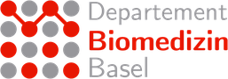
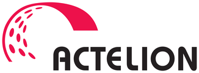
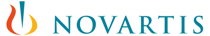
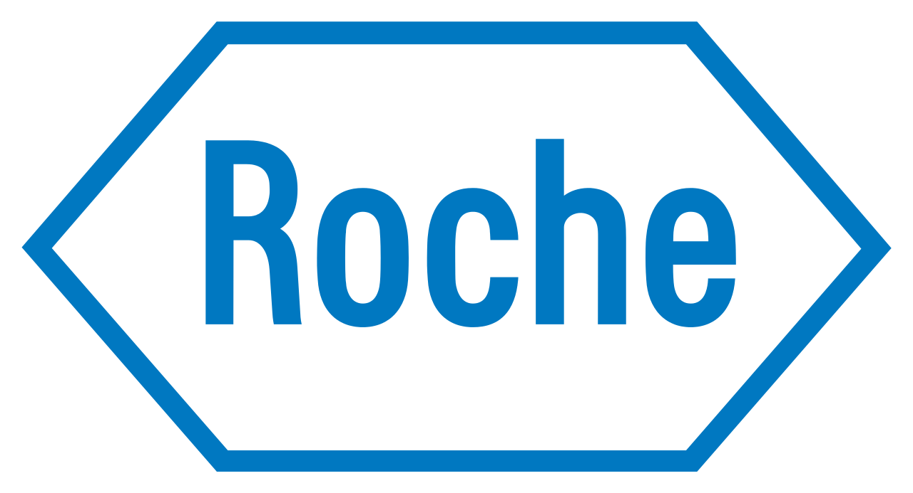
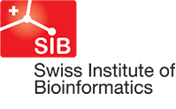
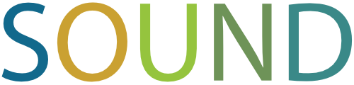

The meeting is aimed at bioinformaticians, programmers and software
engineers who contribute to the Bioconductor project, or are
interested in developing packages for Bioconductor. The goals are to: 

  - foster the exchange of technical expertise
  - keep contributors up to speed with the latest developments
  - coordinate any related efforts.
  
## Topics 

We aim to have a mix of scientific and technical presentations, with
the themes of this year's meeting including: 

 - Strategies for processing large data problems
 - Interactive tools
 - Reproducibility in high-throughput research
 - Emergent biological applications and technologies
 - Flashlight talks

## Programme

The conference will include invited talks and flashlight presentations (each 15 minutes). See the [conference schedule](./program) for details.

## Contact
  
For questions, please contact Florian Hahne florian.hahne'at'novartis.com or Robert Ivanek robert.ivanek'at'unibas.ch 

## Sponsorship

We would like to acknowledge the financial support of our sponsors for
making this event possible.

